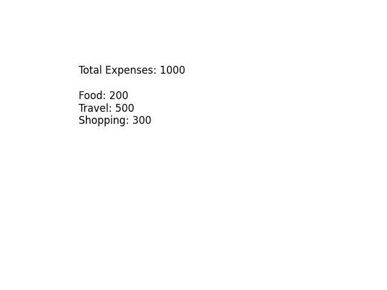
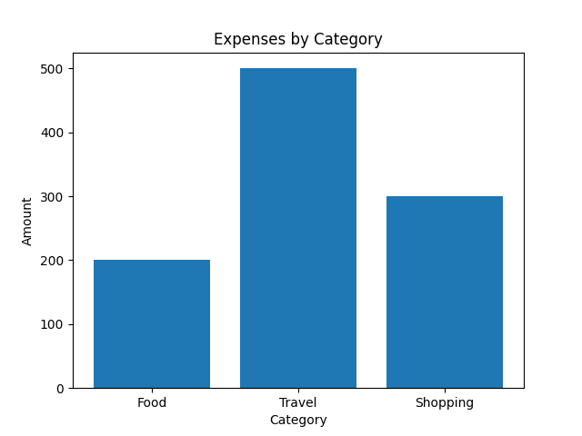
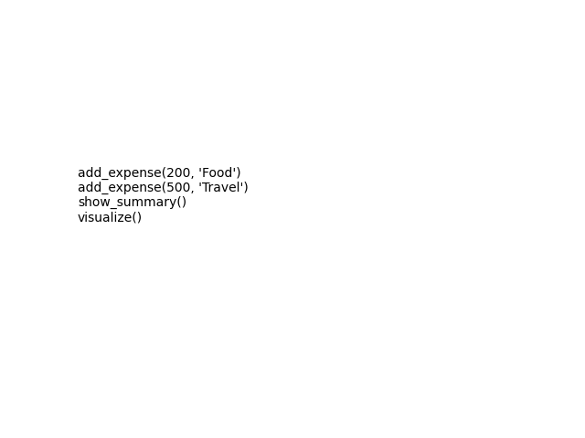

# VITYARTHI-AIML-
THIS IS MY AIML PROJECT
# Smart Expense Tracker

## Overview
This project helps users track daily expenses and analyze spending habits.

## Features
- Add daily expenses
- View total and category-wise spending
- Visualize data using graphs

## Tech Stack
- Python
- Pandas
- Matplotlib

## Installation
```bash
git clone <your-repo-link>
cd expense-tracker
pip install -r requirements.txt
## Screenshots

### Output


### Graph


### Code

